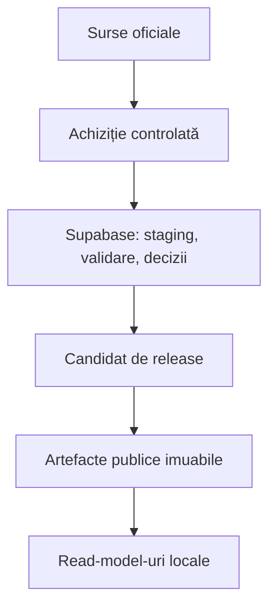

# Teritoriu.digital

**Registrul teritorial deschis al României**

Teritoriu.digital construiește o reprezentare canonică, verificabilă și versionată a structurii teritoriale a României. Proiectul deservește aplicații publice care au nevoie de aceleași județe, UAT-uri, localități, identificatori și geometrii, fără să descarce SIRUTA în timpul cererilor utilizatorilor și fără să împartă o bază de date monolitică.

> [!IMPORTANT]
> Teritoriu.digital nu este, în acest moment, un registru juridic oficial. Publică un model canonic derivat din surse oficiale, împreună cu proveniența, transformările și limitele sale.

## Decizia de fundație

Forma actuală a propunerii legislative justifică folosirea Supabase/PostgreSQL/PostGIS încă din M0, dar numai ca **plan intern de control**:

- ingestie și staging;
- reconcilierea identităților;
- validări și review manual;
- istoric relațional și geospațial;
- sesizări, decizii și audit;
- pregătirea release-urilor.

Distribuția rămâne independentă de baza operațională. Fiecare versiune publicată produce artefacte imuabile, manifest și checksumuri; aplicațiile consumatoare importă explicit o versiune și păstrează read-model-uri locale.



Supabase este un proiect dedicat `teritoriu-digital`. Cheia secretă rămâne exclusiv în pipeline-uri server-side; schema internă `registry` nu este expusă prin Data API.

## Domeniu

În prima etapă, proiectul administrează exclusiv structura teritorială:

- România, regiuni, județe și municipiul București;
- municipii, orașe, comune și sectoare;
- localități componente și sate;
- relații administrative și istorice;
- identificatori oficiali, inclusiv SIRUTA;
- denumiri oficiale și istorice;
- geometrii cu proveniență și licență clare;
- snapshoturi, validări și release-uri.

Registrul de adresare prevăzut de propunerea legislativă este un context distinct. Teritoriu.digital îi poate furniza stratul teritorial și contractele de referențiere, dar nu va introduce străzi, numere administrative sau adrese în MVP.

## Principii nenegociabile

- Nicio sursă externă nu este accesată în requesturile utilizatorilor.
- Un import eșuat nu modifică datele canonice și nu schimbă release-ul activ.
- Un release publicat nu se modifică retroactiv.
- Fiecare artefact are SHA-256, versiune de schemă și proveniență.
- `territory_id` este un UUIDv7 persistent, nededus din nume sau cod SIRUTA.
- Identificatorii oficiali se păstrează cu emitent, statut și perioadă de valabilitate.
- Corecțiile tehnice nu sunt prezentate drept modificări ale sursei oficiale.
- Consumatorii aleg explicit versiunea importată și pot reveni la cea anterioară.

## Structura repository-ului

```text
.
├── .github/workflows/       # CI, bază de date și achiziție programată
├── config/sources/          # surse oficiale și limite fail-closed
├── docs/
│   ├── adr/                 # decizii arhitecturale
│   ├── architecture/        # arhitectura sistemului
│   └── governance/          # roluri și promovarea release-urilor
├── schemas/                 # contracte JSON Schema
├── packages/pipeline/       # discovery, downloader și persistența snapshoturilor
├── scripts/                 # verificări locale fără secrete
└── supabase/
    ├── migrations/          # schema relațională/PostGIS versionată
    └── tests/               # teste pgTAP
```

Interfața Next.js, pipeline-ul de ingestie și API-ul vor fi adăugate incremental, după stabilizarea contractului de date. Nu există încă deployment de producție.

## Verificare locală

Cerințe: Node.js 24 și, pentru testele bazei de date, Supabase CLI plus Docker.

```bash
npm ci
npm test
supabase db start
supabase test db
supabase db lint --level warning
```

## Documentație

- [Arhitectura sistemului](docs/architecture/system.md)
- [Alinierea cu propunerea legislativă](docs/law-alignment.md)
- [Contractul canonic de date](docs/data-contract.md)
- [Registrul inițial al surselor](docs/source-registry.md)
- [Roadmap](docs/roadmap.md)
- [Roluri și promovarea release-urilor](docs/governance/roles-and-promotion.md)
- [Runbook achiziție SIRUTA](docs/runbooks/source-acquisition.md)
- [Runbook backup și restaurare](docs/runbooks/backup-restore.md)

## Stare

Proiectul finalizează **M0** și implementează **M1 — achiziția controlată**. Schema internă este neexpusă public; închiderea etapelor mai cere dovezile live și deciziile enumerate în roadmap.
