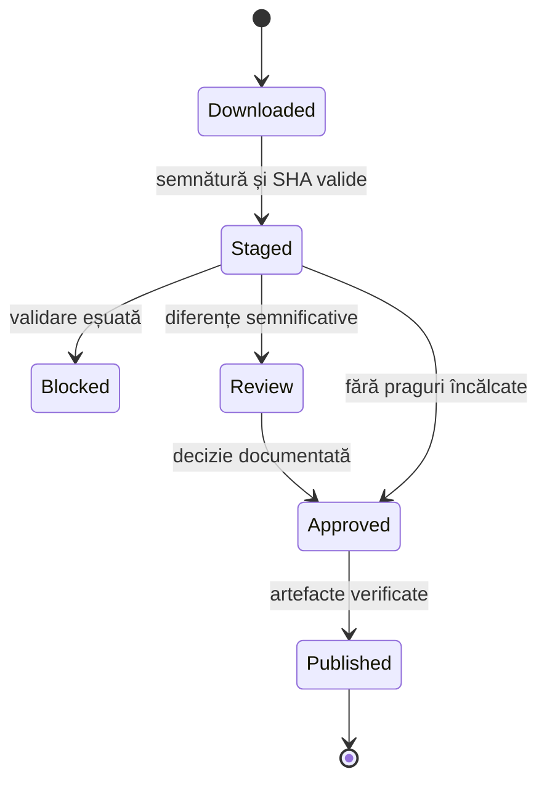

# Arhitectura sistemului

## Componente

| Componentă | Rol | Poate modifica registrul canonic? |
|---|---|---:|
| Discovery/Downloader | Descoperă controlat resursele oficiale, validează hostul, redirecturile, dimensiunea, MIME-ul real și checksumul | Nu |
| Arhivă de snapshoturi | Păstrează exact octeții sursă și metadatele de achiziție | Nu |
| Staging Supabase | Încarcă înregistrările brute într-o execuție izolată și reluabilă | Nu |
| Validator | Rulează verificări structurale, ierarhice, volumetrice și geospațiale | Nu |
| Reconciliere | Leagă înregistrările sursă de identități persistente; trimite ambiguitățile la review | Numai prin decizie |
| Canonical store | Păstrează identități, revizii bitemporale, identificatori, nume, relații și geometrii | Da, tranzacțional |
| Release builder | Produce artefacte deterministe dintr-un candidat aprobat | Nu |
| Publisher | Publică artefactele și schimbă pointerul release-ului activ | Numai pointerul activ |
| API/site | Consultă exclusiv date promovate și indică versiunea/proveniența | Nu |
| Consumer importer | Verifică manifestul și SHA-256, apoi actualizează read-model-ul local | Numai consumatorul |

## Flux de promovare

Nicio etapă eșuată nu schimbă canalul `stable`. O rerulare folosește același snapshot și o cheie de idempotentă derivată din sursă, checksum și versiunea pipeline-ului.

## Bitemporalitate

Reviziile separă:

- timpul de valabilitate (`valid_from`, `valid_to`): când informația produce efecte în realitatea administrativă;
- timpul de înregistrare (`recorded_at`, `recorded_to`): când Teritoriu.digital a cunoscut și a păstrat informația.

Această separare permite reconstituirea stării publicate la o dată și explicarea corecțiilor operate ulterior.

## Limita Supabase

Schema `registry` este un plan de control, nu un API public. Nu este inclusă în `api.schemas` din configurația locală. Pipeline-ul folosește o cheie secretă server-side dedicată; browserul nu primește privilegii de scriere. API-ul public va citi numai proiecții promovate sau artefacte de release și va avea cache, ETag și rate limiting.

## Disponibilitate și recuperare

- Ultimul release valid rămâne disponibil chiar dacă INS, data.gov.ro, ANCPI sau Supabase nu răspund.
- Snapshoturile brute și artefactele publice nu au un singur punct de stocare.
- Backup-ul bazei de control și restaurarea se testează periodic.
- Pointerul `stable` poate reveni la un release anterior fără a modifica release-urile.

